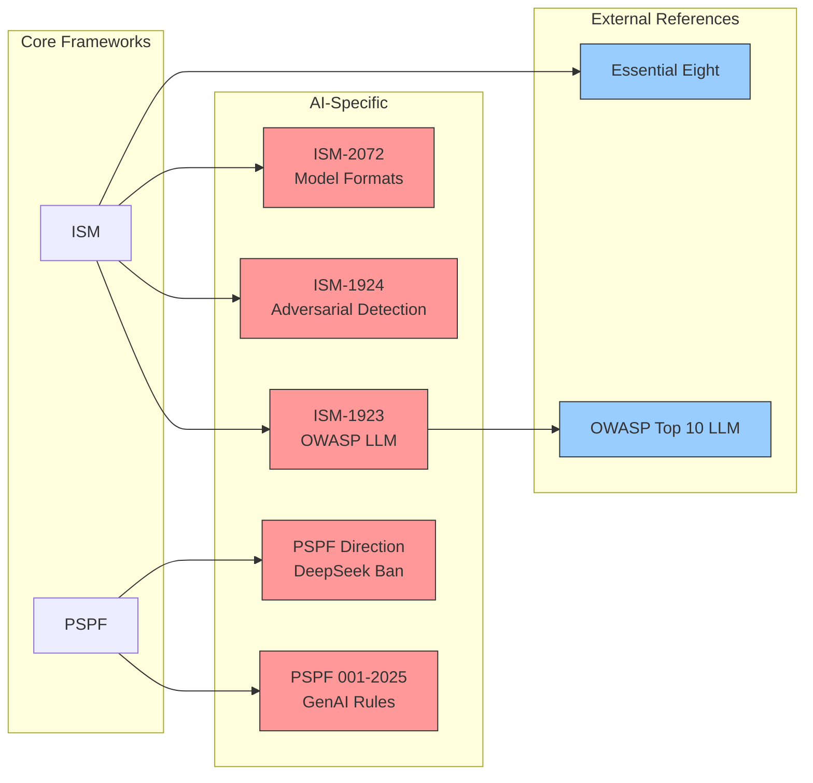
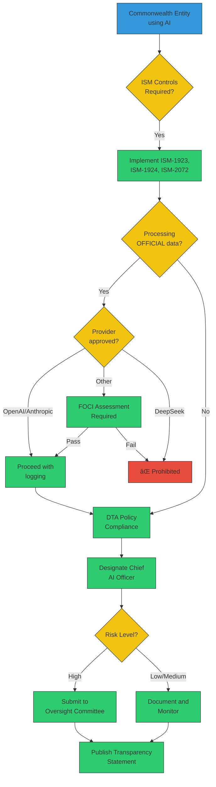
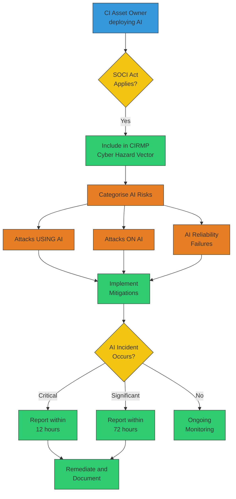
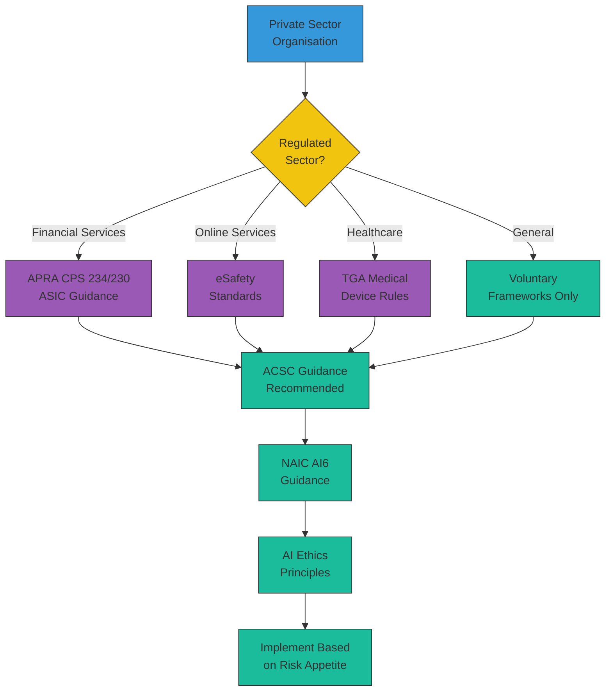

# Knowledge Graph: Australian AI Security Frameworks

> **Visual mapping of framework relationships**

This document provides visual representations of how Australian AI security frameworks connect and relate to each other.

---

## Framework Hierarchy

```mermaid
graph TB
    subgraph Federal["Federal Level"]
        ISM[Information Security Manual]
        PSPF[Protective Security Policy Framework]
        SOCI[SOCI Act / CIRMP]
        DTA[DTA AI Policy v2.0]
        
        subgraph ACSC["ACSC Guidance"]
            ACSC1[Engaging with AI]
            ACSC2[Deploying AI Securely]
            ACSC3[Secure AI Development]
            ACSC4[AI Data Security]
            ACSC5[AI Supply Chain]
        end
        
        subgraph DISR["DISR/NAIC"]
            AI6[AI6 Guidance]
            ETHICS[AI Ethics Principles]
            NAIP[National AI Plan]
            AISI[AI Safety Institute]
        end
    end
    
    subgraph Sector["Sector Regulators"]
        APRA[APRA CPS 234/230]
        ASIC[ASIC Report 798]
        ESAFE[eSafety Standards]
        OAIC[OAIC Privacy]
    end
    
    subgraph National["Cross-Jurisdictional"]
        NFAI[National Framework for AI Assurance]
    end
    
    subgraph States["State/Territory"]
        NSW[NSW AIAF]
        VIC[VIC GenAI Guideline]
        QLD[QLD FAIRA]
        WA[WA AI Policy]
        SA[SA AI Ethics]
        ACT[ACT AI Policy]
        NT[NT Assurance Framework]
        TAS[TAS Guidance]
    end
    
    %% Federal relationships
    ISM --> DTA
    PSPF --> DTA
    ISM --> ACSC1
    ISM --> ACSC2
    
    %% National framework relationships
    NFAI --> NSW
    NFAI --> VIC
    NFAI --> QLD
    NFAI --> WA
    NFAI --> SA
    NFAI --> ACT
    NFAI --> NT
    NFAI --> TAS
    
    %% Ethics principles flow
    ETHICS --> NFAI
    ETHICS --> DTA
    ETHICS --> NSW
    ETHICS --> VIC
    ETHICS --> QLD
    
    %% ISM referenced by states
    ISM -.-> NSW
    ISM -.-> VIC
    ISM -.-> QLD
    ISM -.-> WA
    
    %% Sector flows
    ISM --> APRA
    ISM -.-> ASIC
    
    classDef mandatory fill:#ff6b6b,stroke:#333,stroke-width:2px
    classDef voluntary fill:#4ecdc4,stroke:#333,stroke-width:2px
    classDef sector fill:#ffe66d,stroke:#333,stroke-width:2px
    classDef state fill:#95e1d3,stroke:#333,stroke-width:2px
    
    class ISM,PSPF,SOCI,DTA mandatory
    class ACSC1,ACSC2,ACSC3,ACSC4,ACSC5,AI6,ETHICS voluntary
    class APRA,ASIC,ESAFE,OAIC sector
    class NSW,VIC,QLD,WA,SA,ACT,NT,TAS state
```



---

## Document Relationships

### Federal Framework Dependencies



---

## State Framework Maturity

```mermaid
graph TB
    subgraph Comprehensive["Comprehensive ███"]
        NSW[NSW<br/>AIAF + Ethics + Review Committee]
        WA[WA<br/>Policy v2 + Framework + Advisory Board]
    end
    
    subgraph Developing["Developing ██░"]
        VIC[VIC<br/>GenAI Guideline + VPDSF]
        QLD[QLD<br/>FAIRA + IS18]
        ACT[ACT<br/>Policy + Framework + AIAG]
    end
    
    subgraph Basic["Basic █░░"]
        SA[SA<br/>Ethics Policy + Office for AI]
        NT[NT<br/>Assurance Framework]
    end
    
    subgraph Minimal["Minimal â–‘â–‘â–‘"]
        TAS[TAS<br/>Guidance only]
    end
    
    %% Cross-references
    NSW -.->|referenced by| TAS
    NSW -.->|model for| ACT
    
    classDef comp fill:#2ecc71,stroke:#333,stroke-width:2px
    classDef dev fill:#f39c12,stroke:#333,stroke-width:2px
    classDef basic fill:#e74c3c,stroke:#333,stroke-width:2px
    classDef minimal fill:#95a5a6,stroke:#333,stroke-width:2px
    
    class NSW,WA comp
    class VIC,QLD,ACT dev
    class SA,NT basic
    class TAS minimal
```



---

## Compliance Pathways

### Commonwealth Entity



### Critical Infrastructure Owner



### Private Sector (Voluntary)



---

## Entity Relationship Model

For knowledge graph construction, use these entity types and relationships:

### Entity Types

```yaml
entities:
  Document:
    properties:
      - id: string
      - title: string
      - version: string
      - date: date
      - url: string
      - status: enum[mandatory, voluntary, guidance, framework]
      
  Authority:
    properties:
      - id: string
      - name: string
      - abbreviation: string
      - jurisdiction: enum[federal, nsw, vic, qld, sa, wa, tas, nt, act]
      - type: enum[department, agency, regulator, body]
      
  Control:
    properties:
      - id: string
      - title: string
      - requirement: text
      - applicability: text
      
  Sector:
    properties:
      - id: string
      - name: string
      - regulator: Authority
      
  RiskCategory:
    properties:
      - id: string
      - name: string
      - level: enum[low, medium, high, very_high, prohibited]
      - framework: Document
```

### Relationship Types

```yaml
relationships:
  ISSUED_BY:
    from: Document
    to: Authority
    
  REFERENCES:
    from: Document
    to: Document
    properties:
      - type: enum[mandatory, recommended, informative]
      
  CONTAINS:
    from: Document
    to: Control
    
  APPLIES_TO:
    from: Document
    to: Sector
    
  SUPERSEDES:
    from: Document
    to: Document
    properties:
      - date: date
      
  ALIGNS_WITH:
    from: Document
    to: Document
    properties:
      - standard: string  # e.g., "ISO 42001"
      
  REGULATES:
    from: Authority
    to: Sector
```

---

## Sample Graph Queries

### Neo4j Cypher Examples

**Find all mandatory documents:**
```cypher
MATCH (d:Document {status: 'mandatory'})
RETURN d.title, d.authority, d.date
ORDER BY d.date DESC
```

**Find documents that reference ISM:**
```cypher
MATCH (d:Document)-[:REFERENCES]->(ism:Document {title: 'Information Security Manual'})
RETURN d.title, d.authority
```

**Find compliance path for Commonwealth entity:**
```cypher
MATCH path = (start:Document {title: 'ISM'})-[:REFERENCES*1..3]->(end:Document)
WHERE end.jurisdiction = 'federal'
RETURN path
```

**Find all AI controls:**
```cypher
MATCH (d:Document)-[:CONTAINS]->(c:Control)
WHERE c.title CONTAINS 'AI' OR c.title CONTAINS 'LLM'
RETURN d.title, c.id, c.title, c.requirement
```

---

## Data Files

Raw data for knowledge graph construction is available in the `/data` directory:

- `frameworks.json` - All framework metadata
- `relationships.json` - Document relationships
- `controls.json` - Individual controls
- `authorities.json` - Issuing authorities

---

## Visualisation Tools

Recommended tools for visualising the knowledge graph:

| Tool | Purpose | Link |
|------|---------|------|
| **Neo4j** | Graph database and visualisation | neo4j.com |
| **Obsidian** | Markdown-based knowledge graph | obsidian.md |
| **Kumu** | Relationship mapping | kumu.io |
| **draw.io** | Diagram creation | diagrams.net |
| **Mermaid** | Code-based diagrams | mermaid.js.org |

---

## Contributing

Help improve the knowledge graph:

1. **Add relationships** - Identify connections between documents
2. **Update metadata** - Correct dates, versions, URLs
3. **Extend coverage** - Add missing documents
4. **Build tools** - Create visualisations or query interfaces

See [CONTRIBUTING.md](../CONTRIBUTING.md) for guidelines.

---

[← Back to Index](../README.md) | [Gap Analysis →](GAPS.md) | [Inventory →](INVENTORY.md)
